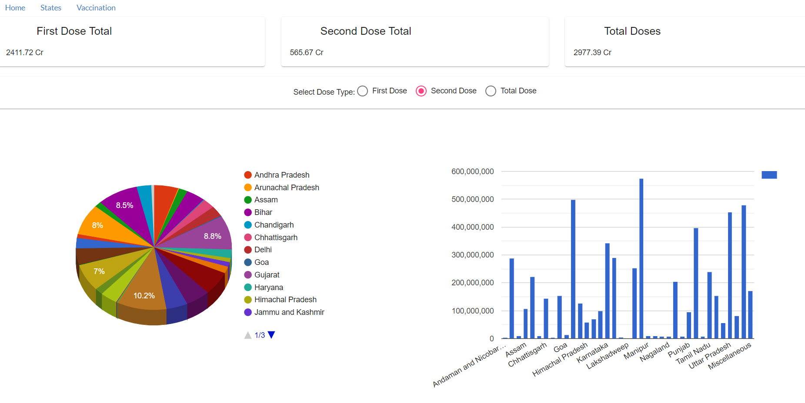

# Covid19Tracker
This project gives the COVID-19 vaccination statewise data  of India for first dose, second dose and total doses of vaccines. The statewise data of doses are also represented in the Pie and Column charts using [angular-google-charts](https://www.npmjs.com/package/angular-google-charts)

[API Reference](http://api.covid19india.org/csv/latest/vaccine_doses_statewise_v2.csv)

The project was generated with [Angular CLI](https://github.com/angular/angular-cli) version 9.1.12.

### App Screenshot 

## Development server

Run `ng serve` for a dev server. Navigate to `http://localhost:4200/`. The app will automatically reload if you change any of the source files.

## Code scaffolding

Run `ng generate component component-name` to generate a new component. You can also use `ng generate directive|pipe|service|class|guard|interface|enum|module`.

## Build

Run `ng build` to build the project. The build artifacts will be stored in the `dist/` directory. Use the `--prod` flag for a production build.

## Installation

- Clone the repo   
`git clone https://github.com/your_username_/Project-Name.git`
- Install NPM packages  
`npm install`  
- Run the application  
`ng serve`

## Further help

To get more help on the Angular CLI use `ng help` or go check out the [Angular CLI README](https://github.com/angular/angular-cli/blob/master/README.md).
